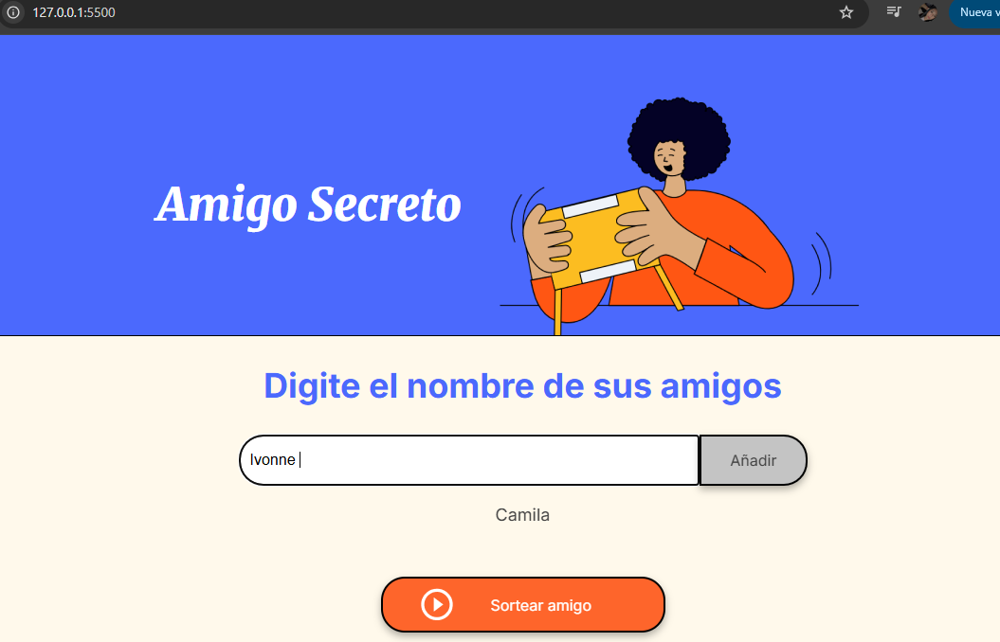

#Challenge Amigo Secreto 

Este desafío implica desarrollar una aplicación donde los usuarios puedan crear una lista de amigos, realizar un sorteo aleatorio y determinar quién será el "Amigo Secreto". Para ello, podrán agregar nombres mediante un campo de texto y un botón, ver la lista completa y, al presionar "Sortear Amigo", obtener un nombre al azar que se mostrará en pantalla.

<h1> Funcionalidades</h1>
*Agregar nombres*
