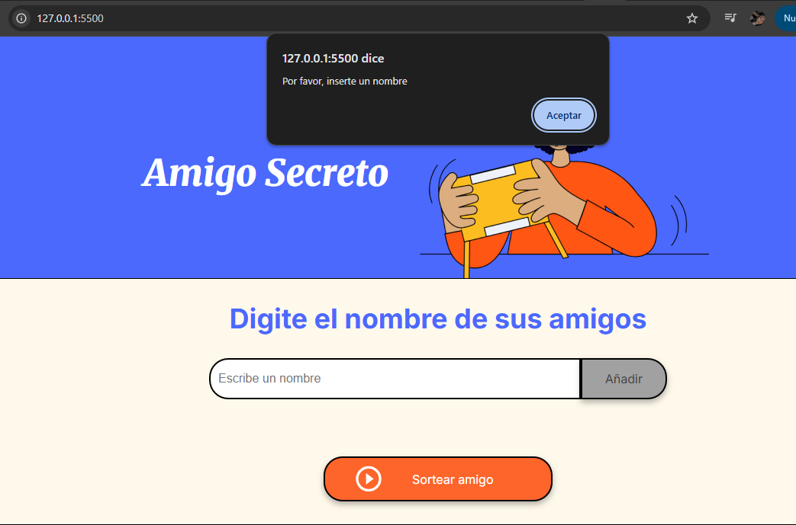
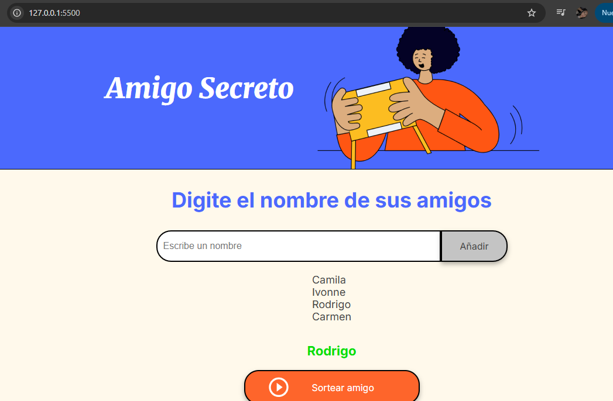

# Challenge Amigo Secreto 

Este desafío implica desarrollar una aplicación donde los usuarios puedan crear una lista de amigos, realizar un sorteo aleatorio y determinar quién será el "Amigo Secreto". Para ello, podrán agregar nombres mediante un campo de texto y un botón, ver la lista completa y, al presionar "Sortear Amigo", obtener un nombre al azar que se mostrará en pantalla.

## Funcionalidades 
- **Agregar nombres**

- **Validación de entrada**

- **Visualizacion de los nombres y sorteo aleatorio**

## Instalación 
 1. Clona el repositorio en tu máquina local 

 2. Navega al directorio del proyecto 

 3. Abre el archivo index.html en tu navegador de preferencia para empezar a usar la aplicación 

 ESPERO QUE TE GUSTE! SALUDOS 